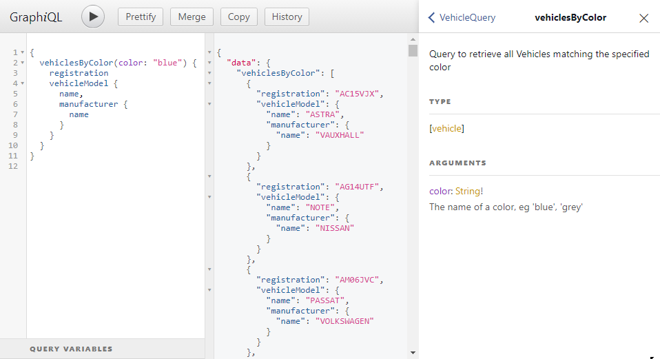

In Module 1, we looked at using REST to expose data and resources from our application over HTTP. In this module, we'll look at a popular alternative to REST: GraphQL.

GraphQL was developed at Facebook in 2012, as a way to expose data for use in mobile apps and single-page web applications. It was released as open source in 2015, and is now maintained by the GraphQL Foundation.

### Adding GraphQL to Autobarn

#### Required NuGet packages

To add GraphQL support to the Autobarn project, we'll start by adding some NuGet packages to the Autobarn.Website project.

```bash
cd Autobarn.Website
dotnet add package GraphQL
dotnet add package GraphQL.NewtonsoftJson
dotnet add package GraphQL.Server.Transports.AspNetCore
dotnet add package GraphQL.MicrosoftDI
dotnet add package GraphiQL
```

* `GraphQL` contains the core GraphQL logic for .NET
* `GraphQL.NewtonsoftJson ` adds support for the `NewtonSoft.Json` serializer
* `GraphSQL.Server.Transports.AspNetCore` provides the HTTP middleware that plugs GraphQL into the ASP.NET request pipeline
* `GraphQL.MicrosoftDI` provides the `.AddGraphQL()` extension methods used to register GraphQL with ASP.NET Core's DI container.
* `GraphiQL` is a graphical front-end that we can use to run GraphQL queries against our API

### GraphQL: Types, Queries and Schemas

GraphQL defines its own set of types and query syntax, which is relatively dissimilar to the type system used by C#, so to add GraphQL support to our application, we need to explicitly define three sets of objects:

* **Types** defines the types of resources exposed by our API - in this case vehicles, models and manufacterers.
* **Queries** defines the specific queries that our API is going to support. Unlike REST, where the client sends a `GET` request and retrieves a predefined resource, GraphQL allows the client to specify exactly which fields and properties should be included in the response. This makes GraphQL extremely efficient – it won't waste bandwidth transferring unnecessary data, which is an advantage when designing apps that work over cellular networks or metered data connections.
* **Schemas** define the relationship between the GraphQL types and queries, and our backend domain model and data store.

Here's the project structure you'll end up with once we've added the GraphQL types to our application:

```diff
Autobarn.Website
├─ Controllers
│   └─...
│
├─ GraphQL
│  ├─ GraphTypes
│  │  ├─ ManufacturerGraphType.cs
│  │  ├─ VehicleGraphType.cs
│  │  └─ VehicleModelGraphType.cs
│  ├─ Queries
│  │  └─ VehicleQuery.cs
│  └─ Schemas
│     └─ AutobarnSchema.cs
│
├───Models
│   └─ ...
├───Properties
│   └─ ...
├───Views
│   └─ ...
└───wwwroot
    └─ ...
```

We're going to add the following classes to our project:

```csharp
// Autobarn.Website/GraphQL/GraphTypes/VehicleGraphType.cs

using Autobarn.Data.Entities;
using GraphQL.Types;

namespace Autobarn.Website.GraphQL.GraphTypes {
	public sealed class VehicleGraphType : ObjectGraphType<Vehicle> {
		public VehicleGraphType() {
			Name = "vehicle";
			Field(c => c.VehicleModel, nullable: false, type: typeof(ModelGraphType))
				.Description("The model of this particular vehicle");
			Field(c => c.Registration);
			Field(c => c.Color);
			Field(c => c.Year);
		}
	}
}
```

```csharp
// Autobarn.Website/GraphQL/GraphTypes/ModelGraphType.cs

using Autobarn.Data.Entities;
using GraphQL.Types;

namespace Autobarn.Website.GraphQL.GraphTypes {
	public sealed class ModelGraphType : ObjectGraphType<Model> {
		public ModelGraphType() {
			Name = "model";
			Field(m => m.Name).Description("The name of this model, e.g. Golf, Beetle, 5 Series, Model X");
			Field(m => m.Manufacturer, type: typeof(ManufacturerGraphType)).Description("The make of this model of car");
		}
	}
}
```

```csharp
// Autobarn.Website/GraphQL/GraphTypes/ManufacturerGraphType.cs

using Autobarn.Data.Entities;
using GraphQL.Types;

namespace Autobarn.Website.GraphQL.GraphTypes {
	public sealed class ManufacturerGraphType : ObjectGraphType<Manufacturer> {
		public ManufacturerGraphType() {
			Name = "manufacturer";
			Field(c => c.Name).Description("The name of the manufacturer, e.g. Tesla, Volkswagen, Ford");
		}
	}
}
```

Add the following code to **GraphQL/Schemas/AutobarnSchema.cs**

```csharp
// Autobarn.Website/GraphQL/Schemas/AutobarnSchema.cs

using Autobarn.Data;
using Autobarn.Website.GraphQL.Queries;
using GraphQL.Types;

namespace Autobarn.Website.GraphQL.Schemas {
	public class AutobarnSchema : Schema {
		public AutobarnSchema(AutobarnDbContext db) => Query = new VehicleQuery(db);
	}
}
```

Add the following code to **GraphQL/Queries/VehicleQuery.cs**

```csharp
// Autobarn.Website/GraphQL/Queries/VehicleQuery.cs

using Autobarn.Data;
using Autobarn.Data.Entities;
using Autobarn.Website.GraphQL.GraphTypes;
using GraphQL;
using GraphQL.Types;
using System;
using System.Collections.Generic;
using System.Linq;

namespace Autobarn.Website.GraphQL.Queries {
	public class VehicleQuery : ObjectGraphType {
		private readonly AutobarnDbContext db;

		public VehicleQuery(AutobarnDbContext db) {
			this.db = db;

			Field<ListGraphType<VehicleGraphType>>("Vehicles")
                .Description("Return all vehicles")
                .Resolve(GetAllVehicles);

            Field<VehicleGraphType>("Vehicle")
                .Description("Get a single car")
                .Arguments(MakeNonNullStringArgument("registration", "The registration of the vehicle you want"))
                .Resolve(GetVehicle);

            Field<ListGraphType<VehicleGraphType>>("VehiclesByColor")
                .Description("Query to retrieve all Vehicles matching the specified color")
                .Arguments(MakeNonNullStringArgument("color", "The name of a color, eg 'blue', 'grey'"))
                .Resolve(GetVehiclesByColor);
		}

		private QueryArgument MakeNonNullStringArgument(string name, string description) {
			return new QueryArgument<NonNullGraphType<StringGraphType>> {
				Name = name, Description = description
			};
		}

		private IEnumerable<Vehicle> GetAllVehicles(IResolveFieldContext<object> context) => db.ListVehicles();

		private Vehicle GetVehicle(IResolveFieldContext<object> context) {
			var registration = context.GetArgument<string>("registration");
			return db.FindVehicle(registration);
		}

		private IEnumerable<Vehicle> GetVehiclesByColor(IResolveFieldContext<object> context) {
			var color = context.GetArgument<string>("color");
			var vehicles = db.ListVehicles().Where(v => v.Color.Contains(color, StringComparison.InvariantCultureIgnoreCase));
			return vehicles;
		}
	}
}
```

We'll need to edit our `Startup.cs` file to register the GraphQL endpoints and services. In `ConfigureServices()`, we need to register the `AutobarnSchema` using the `AddScoped` method, and then add the GraphQL services and the `NewtonsoftJson` serializer. We'll also need to add two lines to `Configure` to register the GraphQL middleware and the GraphiQL frontend.

```diff
public void ConfigureServices(IServiceCollection services) {
	services.AddRouting(options => options.LowercaseUrls = true);
	services.AddControllersWithViews().AddNewtonsoftJson();
	services.AddRazorPages().AddRazorRuntimeCompilation();
	Console.WriteLine(DatabaseMode);
	switch (DatabaseMode) {
		case "sql":
			var sqlConnectionString = Configuration.GetConnectionString("AutobarnSqlConnectionString");
			services.UseAutobarnSqlDatabase(sqlConnectionString);
			break;
		default:
			services.AddSingleton<AutobarnDbContext, AutobarnCsvFileDatabase>();
			break;
	}

+   services.AddGraphQL(builder => builder
+       .AddHttpMiddleware<ISchema>()
+       .AddNewtonsoftJson()
+       .AddSchema<AutobarnSchema>()
+       .AddGraphTypes(typeof(VehicleGraphType).Assembly)
+   );

}

public void Configure(IApplicationBuilder app, IWebHostEnvironment env) {
	if (env.IsDevelopment()) {
		app.UseDeveloperExceptionPage();
	} else {
		app.UseExceptionHandler("/Home/Error");
		app.UseHsts();
	}
	app.UseHttpsRedirection();
	app.UseDefaultFiles();
	app.UseStaticFiles();
	app.UseRouting();
	app.UseAuthorization();

+	app.UseGraphQL<ISchema>();
+	app.UseGraphiQl("/graphiql");

	app.UseEndpoints(endpoints => {
		endpoints.MapControllerRoute(
			name: "default",
			pattern: "{controller=Home}/{action=Index}/{id?}");
	});
}
```

Finally, we need to add one line to our `Program.cs`: the `Newtonsoft.Json` serializer we're using with GraphQL here requires synchronous IO, which is disabled by default in Kestrel (the web server built into ASP.NET), so we need to explicitly enable support for it by adding `options.AllowSynchronousIO = true` to the `webBuilder.ConfigureKestrel` method in `Program.cs`

```diff
public static IHostBuilder CreateHostBuilder(string[] args) =>
	Host.CreateDefaultBuilder(args)
		.ConfigureLogging(logging => {
			logging.ClearProviders();
			logging.AddConsole();
		})
		.ConfigureWebHostDefaults(webBuilder => {
			webBuilder.ConfigureKestrel(options => {
				var pfxPassword = Environment.GetEnvironmentVariable("UrsatilePfxPassword");
				var https = UseCertIfAvailable(@"d:\workshop.ursatile.com\ursatile.com.pfx", pfxPassword);
				options.ListenAnyIP(5000, listenOptions => listenOptions.Protocols = HttpProtocols.Http1AndHttp2);
				options.Listen(IPAddress.Any, 5001, https);
+				options.AllowSynchronousIO = true;
			});
			webBuilder.UseStartup<Startup>();
		}
	);
```

> ℹ You can also run GraphQL - and most of the other examples in this workshop - using the `SystemTextJsonSerializer` instead of `NewtonsoftJson`. The main reason I've stuck with the Newtonsoft serializer is that it has better default support for `camelCase` property names.

## Using GraphiQL

Once you've registered the various bits of the GraphQL stack, open a browser and go to [https://localhost:5001/graphiql](https://localhost:5001/graphiql), and you should see the GraphiQL interface:



Using the GraphiQL GUI, try running these queries against our new GraphQL API:

**List registrations for all vehicles:**

```json
{
  vehicles {
    registration
  }
}
```

**List full details of all silver-coloured cars:**

```json
{
  vehiclesByColor(color: "Silver") {
    registration
    year
    vehicleModel {
      name
      manufacturer {
        name
      }
    }
  }
}
```

## Exercise: Working with GraphQL

Extend the GraphQL API so that you can query for vehicles based on the year of manufacture.

* Create a new query field for `GetVehiclesByYear`
* Add a query parameter for specifying a year of manufacture.
* Add a resolver method that will translate the GraphQL query into a database call.

**Bonus:**

* Extend your query so that you can retrieve vehicles manufactered **before**, **after** or **exactly** in a particular year.
  * There are several ways to achieve this. You could pass in a query parameter string like `“> 1985”` or `“= 1982”`, and then parse this in your resolver. Or you could pass two separate query parameters, one for the year and one for the query type (e.g. a string like `“older”, “newer”, “exact”`)


