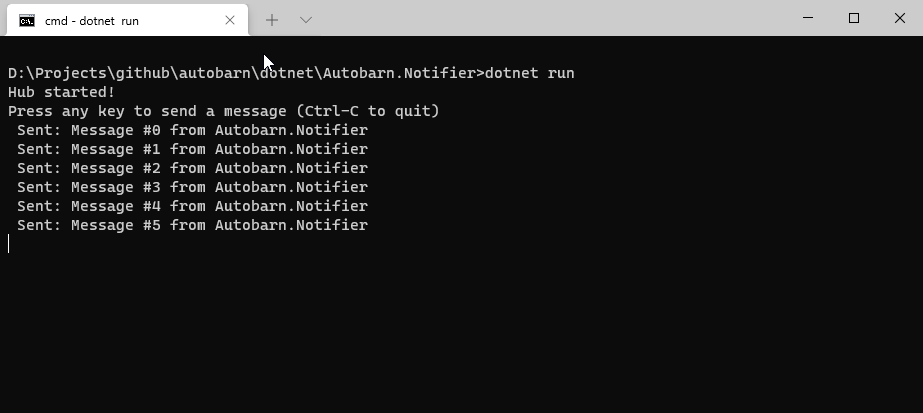
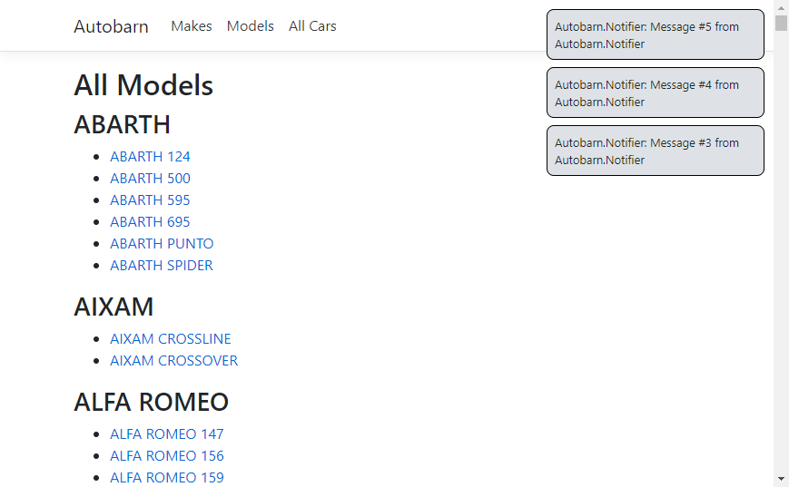

SignalR is an open-source library that allows you to send real-time notifications from back-end (server) code to client-side web applications. In this module, we're going to add a SignalR **hub** to our `Autobarn.Website` web application, and create a simple console application that we can use to push notifications to users who are currently viewing the website.

SignalR requires us to add three things to our application:

1. The server-side component, known as the **hub**, which coordinates messaging between the various components of the application
2. The client-side JavaScript library which connects to the hub and allows us to run client-side JavaScript code when messages are sent via SignalR
3. The code which will actually send messages to the hub

### Adding a SignalR Hub to an ASP.NET Web Application

We're going to add the SignalR hub to our existing `Autobarn.Website` application. 

First, install the SignalR NuGet package:

```
dotnet add package Microsoft.AspNetCore.SignalR
```

Now we need to create the hub. Add a new folder called `Autobarn.Website/Hubs/` and create a new file called `AutobarnHub.cs` with the following code:

```csharp
// Autobarn.Website/Hubs/AutobarnHub.cs

using Microsoft.AspNetCore.SignalR;
using System.Threading.Tasks;

namespace Autobarn.Website.Hubs {
	public class AutobarnHub : Hub {
		public async Task NotifyWebUsers(string user, string message) {
			// The first argument to SendAsync needs to match the 
            // string defined in the handler in our client-side JS code.
			await Clients.All.SendAsync("DisplayNotification", user, message);
		}
	}
}

```

Next, we need to edit `Startup.cs` to add SignalR to our app configuration and register our hub:

In `Startup.ConfigureServices()`, add the line:

`services.AddSignalR()`

Look in `Startup.Configure()` for the call to `app.UseEndpoints` and add the endpoint for our SignalR hub:

```csharp
app.UseEndpoints(endpoints => {
	endpoints.MapControllerRoute(
		name: "default",
		pattern: "{controller=Home}/{action=Index}/{id?}");

	// add this line to register our SignalR hub at /hub
	endpoints.MapHub<AutobarnHub>("/hub");
});
```

### Adding the client-side JavaScript for SignalR

For SignalR to work, we need to add some JavaScript to our pages so that when we send a message via the hub, any connected web browsers will receive a copy of that message and do something useful with it. We're going to add this code to our `_Layout.cs` shared view, so that users will get popup notifications regardless of which page they're viewing.

We'll create an HTML `<div>` element in our page layout to contain our notifications. Open `/Views/Shared/_Layout.cs` and add this line immediately after `</header>`:

```html
<div id="signalr-notifications"></div>
```

Next, add the following lines to the end of `_Layout.cs`, immediately after `</footer>` and before the existing `<script>` tags:

```html
<!-- load SignalR from CloudFlare's CDN -->
<script src="https://cdnjs.cloudflare.com/ajax/libs/microsoft-signalr/3.1.16/signalr.min.js" integrity="sha512-u9ogfmXtxjaWJfZRXKpspzaHvHIG8OHuGEeH4hihu73jX2Z/pBPQy+nLnz5Bc6T7jDbswEaGvIjSwyHTyk37Zw==" crossorigin="anonymous" referrerpolicy="no-referrer"></script>
```

Now we're going to implement our handler code in `~/wwwroot/js/site.js`:

```javascript
$(document).ready(connectToSignalR);

function displayNotification(user, message) {
    console.log(message);
    var $target = $("div#signalr-notifications");
    var $div = $(`<div>${user}: ${message}</div>`);
    $target.prepend($div);
    window.setTimeout(function () { $div.fadeOut(2000, function () { $div.remove(); }); }, 2000);
}

function connectToSignalR() {
    console.log("Connecting to SignalR...");
    window.notificationDivs = new Array();
    var conn = new signalR.HubConnectionBuilder().withUrl("/hub").build();
    conn.on("DisplayNotification", displayNotification);
    conn.start().then(function () {
        console.log("SignalR has started.");
    }).catch(function (err) {
        console.log(err);
    });
}
```

Finally, we'll add two CSS rules to the end of our website's stylesheet file to control the appearance of our notifications. Add this code to the end of `~/wwwroot/css/site.css`:

```css
div#signalr-notifications {
    position: absolute;
    top: 10px;
    right: 10px;
    z-index: 5;
    width: 240px;
    height: auto;
}
div#signalr-notifications div {
    border: 1px solid #000;
    background-color: #dee2e6;
    border-radius: 8px;
    width: 240px;
    padding: 8px;
    margin-bottom: 8px;
    font-size: 80%;
}
```

### Sending messages to a SignalR Hub

SignalR is often used to add real-time communication to web applications, to build things like chat systems, but the real power of SignalR is that we can use it to push notifications from our distributed components and services. To demonstrate this, we're going to create a simple console application called the `Autobarn.Notifier` that will send messages to our SignalR hub. 

Start by creating a new .NET console application:

```
dotnet new console -o Autobarn.Notifier
```

You'll need to install two NuGet packages.; the SignalR client library, and the Newtonsoft JSON serialiser. (SignalR is format-agnostic – it'll can use any data format as long as it's a string – but using JSON makes things a lot more straightforward.)

```
dotnet add package Microsoft.AspNetCore.SignalR.Client
dotnet add package Newtonsoft.Json
```

Now edit the `Program.cs` file:

```csharp
using System;
using System.Threading.Tasks;
using Microsoft.AspNetCore.SignalR.Client;
using Newtonsoft.Json;

namespace Autobarn.Notifier {
	class Program {
		const string SIGNALR_HUB_URL = "https://workshop.ursatile.com:5001/hub";
		private static HubConnection hub;

		static async Task Main(string[] args) {
			hub = new HubConnectionBuilder().WithUrl(SIGNALR_HUB_URL).Build();
			await hub.StartAsync();
			Console.WriteLine("Hub started!");
			Console.WriteLine("Press any key to send a message (Ctrl-C to quit)");
			var i = 0;
			while (true) {
				Console.ReadKey(false);
				// The first argument here needs to match the name 
				// of a method defined in the Signalr Hub
				var message = $"Message #{i++} from Autobarn.Notifier";
				await hub.SendAsync("NotifyWebUsers", "Autobarn.Notifier", message);
				Console.WriteLine($"Sent: {message}");
			}
		}
	}
}
```

Now, start the `Autobarn.Website` and then start your `Autobarn.Notifier` application.

When you press a key to send a message from the notifier, you should see a popup notification in your browser:






 

