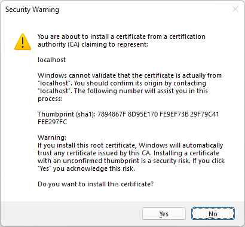

Here's how you can use `openssl` to create self-signed certificates for running HTTPS servers on localhost.

### Create a signing key

```bash
openssl genrsa -out localhost.key 1024
```

### Create a certificate signing request

```bash
openssl req -new -key localhost.key -out localhost.csr
```

When you're prompted for **Common Name**, specify `localhost`. (You can accept the default/blank values for everything else.)

### Sign the certificate:

```bash
openssl x509 -req -days 9999 -in localhost.csr -signkey localhost.key -out localhost.crt
```

### Install the certificate:

#### Windows

1. Double-click the `localhost.crt` file
2. Click **Install Certificate...**
3. For **Store Location**, accept the default of **Current User**
4. For **Certificate Store**, choose **Place all certificates in the following store**
5. **Browse...** and select **Trusted Root Certification Authorities**
6. Click **Next**
7. Click **Finish**

You should get a scary security warning - that means it worked. Click **Yes**:



You should get this:


That means it's working. You can now use your `localhost.crt` and `localhost.key` to run servers on localhost over HTTPS without getting certificate validation warnings.

